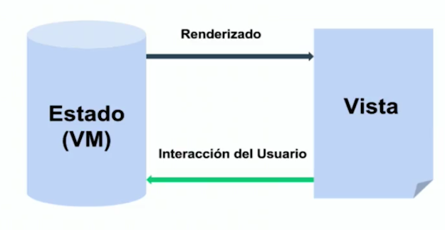
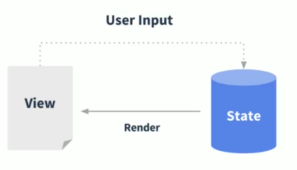
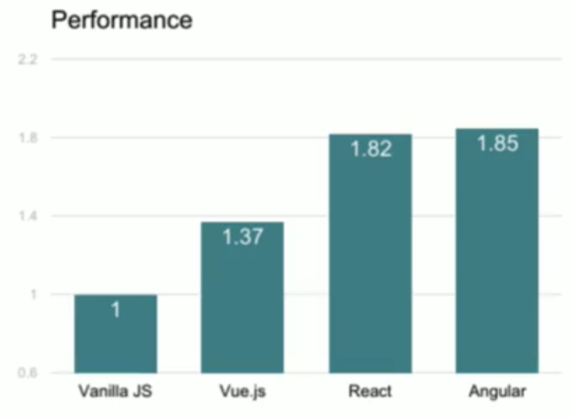
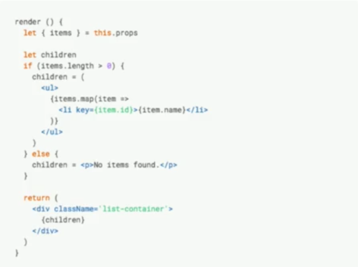
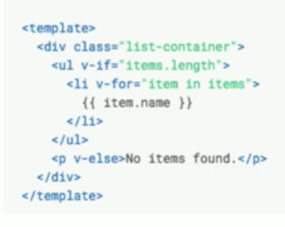
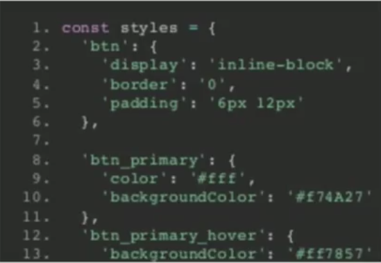
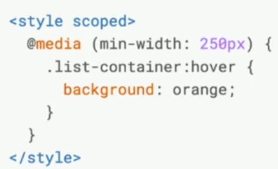

# Vue.js

- Tiene complejidad inherente y complejidad instrumental.
    - La complejidad inherente es la que se hereda del proyecto y no se puede modificar.
    - La complejidad instrumental es la que nosotros podemos controlar. Es el precio que pagamos para resolver la complejidad inherente (herramientas).
    - Las complejidades siempre tiene que ir a la par como por ejemplo:
        - No puedes hacer algo simple con herramientas poderosas. como hacer una landipage con angular o una spa con jquery.        
- ** VueJS** puede ser definido como el Framework Web Progresivo porque nos permite progresivamente ir escalando nuestra aplicación a medida que lo vamos necesitando.

## Soluciones para empresas con Vue.js

## Porque Vue.js
- Porque puedes utilizarlo para aplicaciones desde cero y mejorar las aplicaciones que ya esten echas
- Funcionalidades familiares para desarrolladores de Angular y React.
- Rapido, Facil de entender y aprender.
- +1millon de estrellas en github
    - Esto hace que vuejs sea un proyecto que tiene gran apoyo de la comunidad

## Quien usa Vue.js?
- Un equipo pequeño o un individuo que este creando un prototipo o una aplicacion pequeña.
- Grandes equipos para colaborar grandes aplicaciones es bueno usar vuejs pero para aplicaciones gigantezcas es mejor usar Reactjs o Angular.
- Desarrolladores experimentados contratados para solucionar un área problemática de un sitio web heredado.
    - Añadir una nueva funcionalidad con vuejs es una excelente opción.

## Prerequisitos para usar Vuejs.
- Conocimientos basicos de Javascript, CSS y HTML.
- Un editor como Atom, Visual Studio Code o IDE con WebStorm.
- Un servidor local
    - Apache
    - http-server
    - Vue CLI

## Que es Vue.js?
- Una biblioteca o libreria de Javascript  
- Motor de renderizado, como entrada un modelo de datos y componentes y un salida HTML.
- Una herramienta de colaboración que permite la segmentación de aplicaciones en parcelas de trabajo más pequeñas, utilizando componentes.

## Caracteristicas
- Framework Progresivo
    - Similar JQuery porque como JQuery en su tiempo no dio la facilidad de resumir el codigo.
    - Puede crecer progresivamente aumentandolo lo que necesitemos
    - Muy bueno para iniciar un proyecto
- MV*: Model View lo que sea
    - Vistas que estan atadas a los modelos.
- Reactivo
    - Al cambiar los modelos al cambiar vista automaticamente cambiara
    - Vue se encara de la reactividad.
- Vue.js core: UI su principal funcionalidad para darle otras funciones se necesitara añadirles nuevas librerias.
    - DX: Experiencia de desarrollo
    - vue-router: Convertirlo en una SPA.
    - vuex: para el manejo de estados
    - nuxt: para el server side render(SSR) para el renderizado en el servidor.
- Renderizado declarativo: 
- Sistemas de componentes: Es un arbol el cual tiene sus hijos
    - 
- Facil de aprender: Especialmente para diseñadores.
- Vue.js + Tools + librerias = SPA

### Renderizado declarativo

### Sistemas de componentes

### Estado y la Vista

## Capacidades y limitaciones
- **Que hace vuejs**
    - Genera codigo HTML para los navegadores.
    - Interacción con el usuario
    - Vue utiliza tecnicas especializadas al igual que React y Angular para el proceso de la aplicación.
    - Funciona en cualquier navegador sin ningun paso de compilación.
- **Que no hace vuejs**
    - Vue no crea un servidor para tu aplicación 
    - Vue no prueba el codigo y si hay errores vue intentara seguir ejecutandose
    - Vue no proporciona metodos de utilidad significativa. 
        - Solo puedes utilzar el core y si quieres añadir utilizar algo nuevo lo tiens que añadir.
    - No facilita el routing para esto utilizas el complemento Vue-Router.
    - A diferencia de Angular, vuejs no tienes modulos sino utiliza los de ES6.
    
## Reactividad y Vue
- Reactividad es la forma que una aplicacion cambia en respuesta alguna actividad.
- **Porque la Reactividad es importante**
    - JavaScript no tiene implementada la reactividad y este poder se implementa Gracias a bibliotecas como Vuejs, Angular y Reactjs.
    - Si la reactividad no se implementa correctamente puede ser extramadamente lenta.
    - Vue resuelve el problema de la Reactividad y lo implementa de la misma manera que en Angular y React.

## Donde deberia usar Vue.js
- Modernizando las aplicaciones heredadas: Una aplicacion antigua que esta funcionando bien pero que es lenta esta es una buena opcion de utilizar vue.
    - Vue se puede incluir incrementalmente en un proyecto antiguo.
    - Replazar areas criticas del proyecto sin modificar la estructura sin romper nada de lo que se tiene.
    - Vue coexiste con React Angular y jquery.
    - Los beneficios son inmediatos y se vera las mejoras muy rapidamente.
- Construyendo aplicaciones en Equipo.
    - Los componentes permiten la separación de fucionalidades.
    - Los desarrolladores de HTML, CSS y Javascript pueden trabajar juntos.
    - La creciente aceptacion de vue proporcina que mas conoscan esta tecnologia y esten familiarizados con vue.    
    - Las bibliotecas del ecosistema proporcionan las herramientas necesarias para la creacion de las aplicaciones que se tendra en produccion.
- La mejor herramineta para crear prototipos.
    - con el CDN de vue se puede implementar una aplicacion en vue muy rapidamente.
    - El rendimiento de un prototipo en vue es muy rapido no importa si se muestra una lista de 100 o 1000 elementos igualmente sera rapido.
    - Es muy facil convertir ese prototipo en una aplicacion completa con componentes y organizada.
### Performance

[https://stefankrause.net/js-frameworks-benchmark4/webdriver-ts/table.html](https://stefankrause.net/js-frameworks-benchmark4/webdriver-ts/table.html)

## Vue.js vs React

### Similitudes
 - Virtual DOM
    - DOM son las estiquetas
    - Virtual DOM es crear un estructura virtual para saber que cambia se sabe cada estado
 - Componentes
    - En ambos se puede crear componentes reutilizables
 - Libreria core solo para UI
    -  Si queremos manejar el estado de una manera mas compleja tendriamos que utilizar en React Redux y en Vuejs Vuex

 ### Performance
- Minimizar las interacciones con el DOM
    - 
- Minimizar los calculos de JavaScript para saber que modificar.

### Update Performance
- ShouldComponenteUpdate y estructuras de datos inmutables
- Dependecias auto-trackeadas

### Developer Experience
- Ayuda mas al desarrollador

### HTML
- React = JavaScript everywhere (JSX)

- Vue.js = Templates

### CSS

- React = CSS in JS

- Vuejs = Component-Scoped CSS

### Librerias
- Redux <-> Vuex
- React Router <-> vue-router

## Vue vs Angular
- TypeScript
    - En angular es mas recomendado y en vue es opcional
- Performance y tamaño
    - Vue es mas rapido
    - Vue pesa la mitad de Angular
- Flexibilidad
    - Angular es un Framework
    - Salir del esquema de Angular es mas dificil
    - Vuejs solo se encarga de la vista
    - Vuejs podemos integrar o no mas librerias para hacerlo mas complejo.
- Curva de aprendisaje
    - Vue es mucho mas rapido aprenderlo: HTML+CSS+JS
    - Angular necesitar aprender mas cosas: HTML+CSS+JS+TypeScript+Servicios